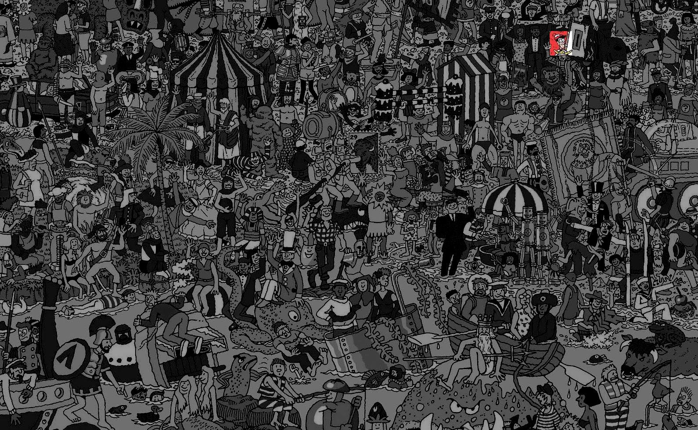
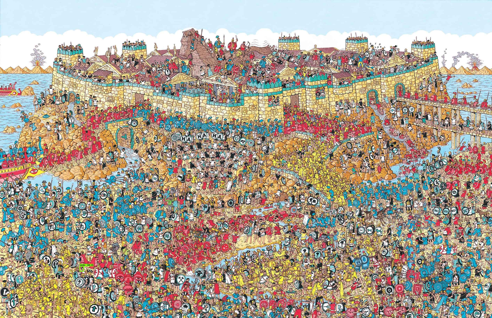

# Finding-Wally

A solution to the infamous puzzle "Where is Wally/Waldo?". I have implemented two approaches to find the position of Wally in a puzzle.

 

1. <b>Template Based Approach</b>:
    
    In this approach, the user has to provide 2 images - one of the puzzle and another one of Wally cropped out from the same image. It is a sort of pattern matching approach which helps the user to locate Wally in the puzzle.
    &nbsp;
    &nbsp;
    
    <b>Inputs: </b>
    &nbsp;
    <table>
    <tr>
        <th align=center>Puzzle</th>
        <th align=center>Wally</th>
    </tr>
    <tr>
        <td></td>
        <td></td>
    </tr>
    </table>
    &nbsp;
    &nbsp;
    
    <b>Output: </b>
    &nbsp;
    
    
  
 
  
2. <b>Deep Learning Based Approach</b>:

    An object detection algorithm is trained on an annotated dataset consisting of a collection of several images of the same nature. The model used for detection is "Faster RCNN with Inception v2". This allows the user to detect Wally from any image without any input of Wally's image.
    

    <b>Input: </b>\
    &nbsp;
    
    &nbsp;
    &nbsp;
    
    <b>Output: </b>

    

    
(Wally is at the bottom left marked in green box with confidence score)

